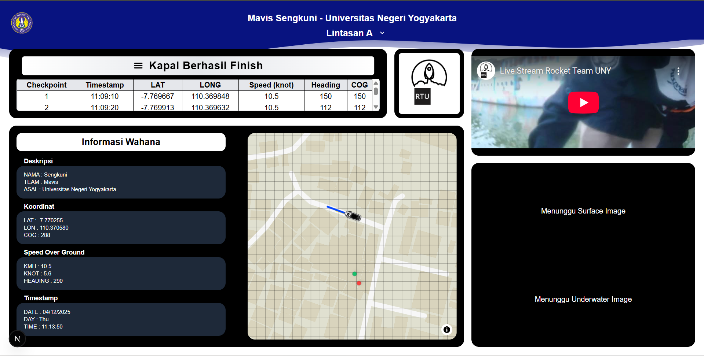
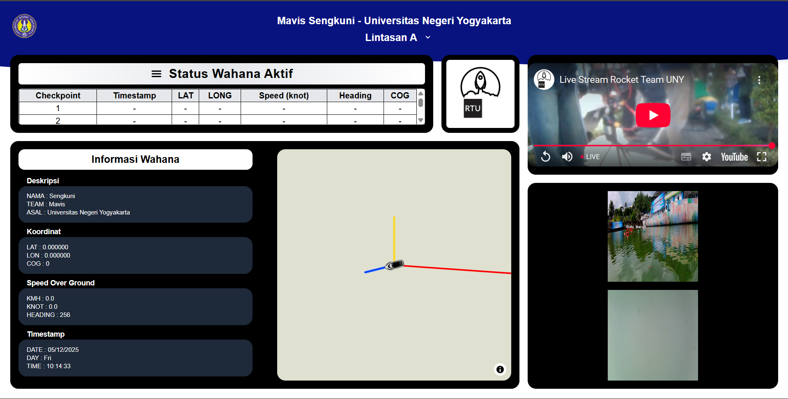
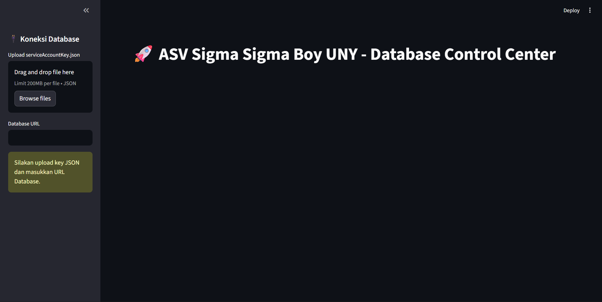

# 🚤 Mavis Sengkuni - Monitoring Wahana Dashboard

Mavis Sengkuni adalah aplikasi Monitoring Wahana atau Vehicle Monitoring System (VMS) berbasis web yang dikembangkan oleh tim **Mavis Universitas Negeri Yogyakarta**. Aplikasi ini dirancang untuk memantau pergerakan dan status wahana ASV (Autonomous Surface Vehicle) "Sengkuni" secara real-time menggunakan integrasi database Firebase.



## Fitur Utama

* **Real-Time Telemetry Data:** Integrasi langsung dengan Firebase Realtime Database untuk menampilkan koordinat GPS, *Course Over Ground* (COG), dan kecepatan (KMH/Knot) secara instan.
* **Peta Interaktif (MapLibre):** Visualisasi posisi wahana di peta dengan fitur:
    * **Trajectory Tracking:** Garis merah yang menunjukkan riwayat jalur yang telah dilalui.
    * **Heading & COG:** Indikator arah hadap wahana dan proyeksi arah gerak (garis kuning).
    * **Dynamic Grid:** Grid dinamis pada peta untuk membantu estimasi jarak antar titik.
* **Sistem Monitoring Checkpoint:** Tabel log otomatis yang mencatat waktu, koordinat, dan kecepatan setiap kali wahana melewati titik checkpoint (1-13).
* **Dual-Camera Capture:** Menampilkan hasil tangkapan gambar terbaru dari dua kamera (Surface & Underwater) dalam format Base64.
* **Lintasan Selector:** Fitur untuk memilih mode lintasan (A atau B) yang menyesuaikan orientasi navigasi pada dashboard.
* **Livestream:** Video Livestream Embeded dari Youtube.com yang menampilkan POV dari wahana secara real-time.

## Tech Stack

* **Framework:** Next.js (React)
* **Styling:** Tailwind CSS
* **Database:** Firebase Realtime Database
* **Mapping:** MapLibre GL & React Map GL
* **Components:** * `react-wavify` (Animasi ombak header)
    * `lucide-react` / Heroicons (Ikonografi)

## Struktur Data Firebase

Aplikasi ini mengharapkan struktur data berikut pada Firebase:
* `Data/GPS_DATA`: Latitude, Longitude, COG.
* `Data/Speed Over Ground`: SOG_KMH, SOG_KNOT, Heading.
* `Data/Centerpoint Garis`: Gambar Base64 (Surface & Underwater), Date, Time.
* `Data/Checkpoint`: Riwayat data tiap pos.

## Cara Menjalankan Lokal

1.  **Clone repositori:**
    ```bash
    git clone [https://github.com/username/mavis-sengkuni.git](https://github.com/username/mavis-sengkuni.git)
    cd mavis-sengkuni
    ```

2.  **Instal dependensi:**
    ```bash
    npm install requirements.txt
    ```

3.  **Konfigurasi Firebase:**
    Pastikan file `firebaseConfig.js` sudah dikonfigurasi dengan API Key proyek. Pakai .env.local kalo sempat.

4.  **Jalankan aplikasi:**
    ```bash
    npm run dev
    ```
    Aplikasi akan tersedia di `http://localhost:3000`.



---
# 🖥️ Database Control Center - Dashboard Mengubah Data Firebase

Database Control Center berfungsi menambah, menghapus, dan mengedit data di Firebase untuk menyesuaikan kondisi data yang akan ditampilkan di sistem monitoring sebelum lomba dimulai.



## Fitur Utama

* **Reset Database:** Fitur untuk mengosongkan nilai dinamis databases seperti checkpoint time, serta surface dan underwater capture sebelum memulai misi baru.
* **Mission Planner:** Mengunggah koordinat lintasan (Lintasan A atau B) secara otomatis ke Firebase.
* **Data Export:** Mengunduh log riwayat checkpoint dan data telemetri ke format JSON atau Excel (.xlsx) untuk analisis pasca-misi lomba.
* **Simulation Monitoring:** Menjalankan sebuah script python yang mensimulasikan jalannya wahana.


## Tech Stack

* **Framework:** Streamlit
* **Database:** Firebase Realtime Database
* **Components:** * `pandas`
    * `Openpyxl`

## Cara Menjalankan Lokal

1.  **Clone repositori:**
    ```bash
    git clone [https://github.com/username/mavis-sengkuni.git](https://github.com/username/mavis-sengkuni.git)
    cd mavis-sengkuni
    ```

2.  **Instal dependensi:**
    ```bash
    pip install py_requirements.txt
    ```

3.  **Persiapan Konfigurasi Firebase:**
    Pastikan file `serviceAccountKey.json` sudah diunduh dan database URL sudah disalin.

4.  **Jalankan aplikasi:**
    ```bash
    streamlit run crud.py
    ```
    Aplikasi akan tersedia di `http://localhost:8501/`.

5.  **Konfigurasi Firebase:**
    Pilih file `serviceAccountKey.json` dan masukkan database URL sesuai arahan.
    
6.  **Menjalankan Simulasi:**
    Di Terminal lain jalankan
    ```bash
    python simulasi.py
    ```
---
**Mavis Team - Universitas Negeri Yogyakarta**
